# Resumen introductorio — RAG de alta precisión y arquitectura de agentes

> Guía de conceptos para leer **antes** de empezar el pre-curso. No es el temario del pre-curso en sí (eso vive en `.github/docs/curriculum.md`): es el mapa mental de los 37 temas del curso de UTN, con diagramas, para que cada fase que hagas tenga un lugar dónde encajar.

---

## 0. El mapa completo

El curso tiene tres módulos que se construyen uno sobre el otro: primero mejorás **qué** le das de comer al modelo (Módulo 1), después le das **memoria del mundo** y una forma de **medir si funciona** (Módulo 2), y por último lo hacés **actuar y colaborar** de forma controlada (Módulo 3).

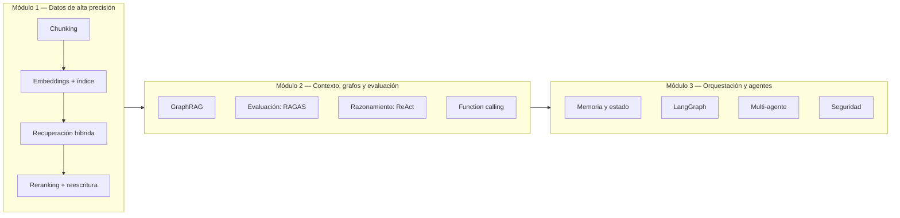

Una forma simple de pensarlo: **M1 es RAG bien hecho. M2 es RAG que se puede medir y que empieza a razonar. M3 es varios de esos razonadores trabajando juntos, con memoria y con barandas de seguridad.**

---

## 1. Módulo 1 — Arquitectura RAG de alta precisión

### 1.1 El pipeline RAG completo

RAG (*Retrieval-Augmented Generation*) es, en el fondo, una forma de responder con datos que el modelo no tiene memorizados: en vez de confiar en lo que aprendió durante el entrenamiento, **buscás información relevante y se la das como contexto** en el prompt.

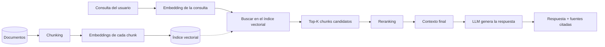

La mitad de abajo del diagrama (documentos → chunking → embeddings → índice) pasa **una sola vez**, cuando cargás tus datos. La mitad de arriba (consulta → búsqueda → respuesta) pasa **en cada pregunta**. Este pre-curso practica primero cada pieza por separado, y después las conecta.

### 1.2 Limitaciones del RAG estándar en producción

El RAG "básico" (chunkear en trozos fijos, embeber, buscar top-K, pegar todo en el prompt) falla de formas predecibles:

- **Chunk cortado a la mitad de una idea:** el trozo que se recupera no tiene sentido solo.
- **Consulta ambigua:** "¿cuándo se resolvió?" — ¿se resolvió qué?
- **Preguntas multi-hop:** la respuesta necesita combinar dos documentos distintos, y el top-K trae solo uno.
- **Dato desactualizado:** el índice no se actualizó y el documento que se recupera ya no es válido.
- **Ruido:** el top-K trae chunks parecidos por vocabulario pero irrelevantes en el fondo.

Todo el resto del Módulo 1 es, en el fondo, un catálogo de técnicas para atacar cada una de estas fallas.

### 1.3 Chunking: cómo cortar los documentos

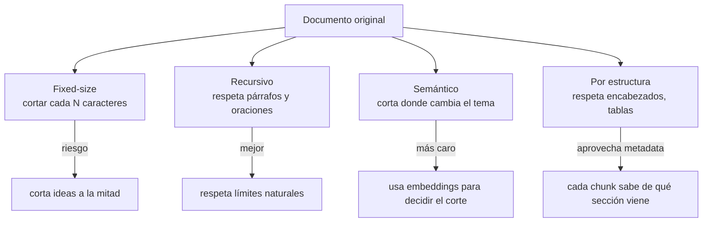

- **Fixed-size:** simple y predecible, pero ciego al contenido.
- **Recursivo:** intenta cortar primero por párrafo, después por oración, y solo como último recurso por caracteres. Es el punto de partida razonable.
- **Semántico:** mide la similitud entre oraciones consecutivas y corta donde el tema cambia. Más preciso, más caro de calcular.
- **Por estructura del documento:** un Markdown con encabezados, o un PDF con tablas, tiene pistas de dónde cortar que no son solo de texto.

**Parent-Document Retrieval** es una técnica que resuelve una tensión: los chunks chicos son mejores para *buscar* (más precisos, menos ruido), pero los chunks grandes son mejores para *responder* (más contexto). La solución: buscás con chunks chicos ("hijos"), pero cuando encontrás uno, le devolvés al LLM el documento "padre" completo (o una porción más grande) al que pertenece.

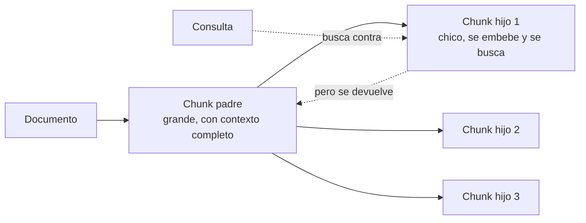

### 1.4 Embeddings y bases vectoriales

Un **embedding** es un vector de números que representa el *significado* de un texto. Dos textos con significados parecidos tienen vectores "cercanos" en ese espacio (medido con similitud coseno, la más común).

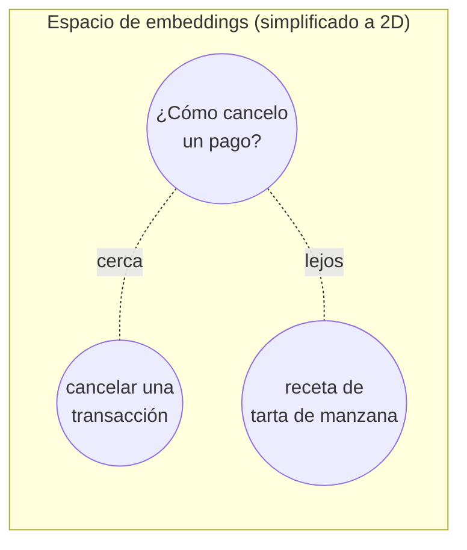

Algunas cosas importantes que el curso pide dominar:

- **La dimensión del vector importa:** más dimensiones capturan más matices, pero pesan más y cuestan más buscar.
- **Un embedding NO es un token.** Un token es una unidad de texto que el modelo procesa; un embedding es la representación numérica del significado de un texto completo (o un chunk). Es una de las confusiones más comunes al empezar.
- **RAG no entrena al modelo.** El modelo no "aprende" tus documentos: en cada consulta le pasás el contexto relevante como parte del prompt. Si mañana borrás el documento del índice, el modelo lo "olvida" al instante, porque nunca lo supo de memoria.

**Índices vectoriales — HNSW e IVF.** Buscar el vecino más cercano comparando contra *todos* los vectores es preciso pero lento cuando hay millones de ellos. Los índices sacrifican un poco de precisión (recall) a cambio de mucha velocidad.

```mermaid
flowchart TD
    subgraph HNSW["HNSW — grafo de capas"]
        direction TB
        L2[Capa superior<br/>pocos nodos, saltos largos] --> L1[Capa media]
        L1 --> L0[Capa inferior<br/>todos los nodos, saltos cortos]
    end
    subgraph IVF["IVF — listas invertidas"]
        direction TB
        C1[Cluster 1] 
        C2[Cluster 2]
        C3[Cluster 3]
        Q2[Consulta] -.1. encuentra el cluster más cercano.-> C2
        C2 -.2. busca solo ahí dentro.-> R2[Resultados]
    end
```

- **HNSW** (*Hierarchical Navigable Small World*): un grafo en capas. Empezás en la capa de arriba (pocos nodos, saltos grandes) y bajás acercándote cada vez más al destino. Buen recall, más memoria.
- **IVF** (*Inverted File Index*): agrupa los vectores en clusters (`nlist` clusters). En la búsqueda, primero elige los clusters más prometedores (`nprobe` de ellos) y busca solo ahí dentro. Menos memoria, hay que ajustar cuántos clusters visitar.

El trade-off siempre es el mismo triángulo: **recall (qué tan seguido encontrás lo correcto) vs latencia vs memoria.** Con pocos miles de vectores, a veces ni hace falta un índice: buscar contra todos alcanza.

**Elegir un modelo de embeddings** depende de: idioma (un modelo entrenado sobre todo en inglés puede rendir peor en español), dominio (vocabulario técnico específico), dimensión, largo máximo de entrada, latencia, costo y licencia.

### 1.5 Recuperación híbrida y filtrado

La búsqueda vectorial es buena para el *significado*, pero mala para cosas literales: nombres propios, códigos de error, números exactos. Ahí es donde entra **BM25**, un algoritmo de búsqueda léxica tradicional (basado en la frecuencia de palabras, como un buscador clásico).

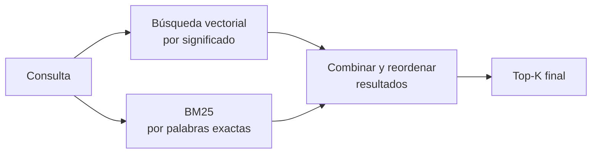

**Filtrado por metadatos:** además de buscar por contenido, podés restringir por atributos (fecha, categoría, autor, tipo de documento). La decisión de diseño importante es **cuándo aplicar el filtro**: antes de la búsqueda vectorial (reduce el espacio de búsqueda, pero si el filtro es muy restrictivo podés terminar con pocos o cero candidatos) o después (buscás primero y filtrás el resultado, con el riesgo de que el top-K ya venga sin nada que pase el filtro).

### 1.6 Reranking y transformación de consultas

**Reranking:** la búsqueda inicial (vectorial + BM25) es rápida pero aproximada. Un segundo paso, más caro pero más preciso, reordena solo los pocos candidatos que sobrevivieron.

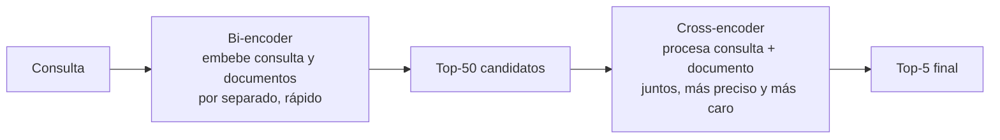

- **Bi-encoder:** embebe la consulta y cada documento por separado (por eso los embeddings de los documentos se pueden precalcular). Es lo que usa la búsqueda inicial.
- **Cross-encoder:** procesa la consulta y el documento **juntos**, en una sola pasada por el modelo. Es mucho más preciso porque puede "prestar atención" entre ambos textos, pero no se puede precalcular — por eso solo se usa sobre un puñado de candidatos, nunca sobre todo el índice.

**Transformación de consultas** — mejorar la pregunta antes de buscar:

- **Query rewriting / desambiguación:** reformular una consulta vaga o corregir ambigüedades antes de buscar.
- **HyDE** (*Hypothetical Document Embeddings*): en vez de embeber la consulta tal cual, le pedís al LLM que genere una respuesta hipotética (aunque no sepa si es correcta) y embebés *esa* respuesta para buscar. La intuición: una respuesta hipotética suele parecerse más, en vocabulario y estructura, a los documentos reales que la pregunta original.

---

## 2. Módulo 2 — Contexto avanzado, grafos de conocimiento y evaluación

### 2.1 GraphRAG y datos estructurados

RAG vectorial recupera fragmentos de texto sueltos. Pero hay preguntas que necesitan **conectar varios hechos entre sí** ("¿qué pagos fallaron con proveedores que también tuvieron incidentes el mes pasado?"). Para eso sirve modelar los datos como un **grafo de conocimiento**: entidades (nodos) y relaciones entre ellas (aristas).

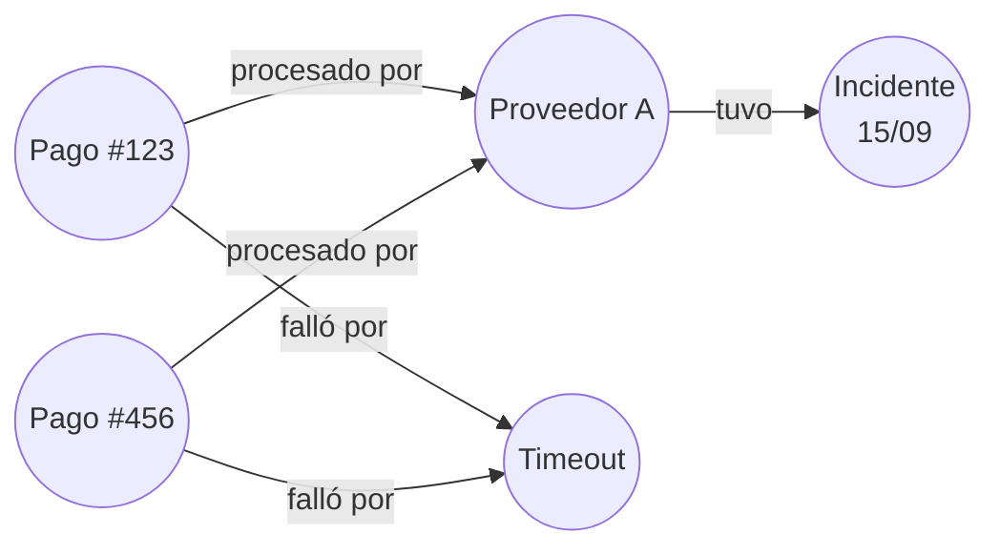

Con este grafo, una pregunta de **varios saltos** (*multi-hop*) como "¿qué pagos fallaron con un proveedor que tuvo un incidente reciente?" se responde recorriendo relaciones, no buscando por similitud de texto. El costo: construir el grafo (a veces con un LLM extrayendo entidades y relaciones de texto no estructurado, lo cual tiene su propio error y costo) y mantenerlo actualizado. GraphRAG **no siempre conviene** — para preguntas simples de "encontrar el documento más parecido", un RAG vectorial es más simple y más barato.

### 2.2 Evaluar sistemas RAG

Medir "¿anda bien mi RAG?" no es solo mirar si la respuesta "suena bien". Hay métricas específicas:

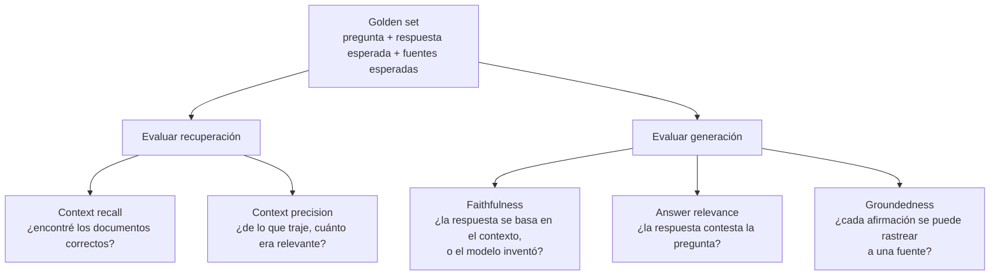

- **Recall@k / MRR:** de las preguntas del golden set, ¿en qué fracción de los casos el documento correcto apareció entre los primeros K resultados? MRR (*Mean Reciprocal Rank*) además premia que aparezca lo más arriba posible.
- **Faithfulness / groundedness:** la respuesta puede sonar coherente y estar completamente inventada (alucinación) a pesar de tener el contexto correcto delante. Estas métricas —típicamente calculadas con otro LLM como "juez"— miden si cada afirmación de la respuesta realmente se sostiene en el contexto recuperado.
- **RAGAS** es un framework (Python) que automatiza el cálculo de estas métricas sobre un golden set.
- **Costo y latencia** también son parte de la evaluación: cachear respuestas frecuentes, elegir el modelo más barato que alcance para la tarea, reducir el K de recuperación, comprimir el contexto.

### 2.3 Razonamiento agéntico

Un **agente** es un sistema donde el LLM no solo genera texto, sino que **decide qué hacer a continuación**: qué herramienta usar, si necesita más información, cuándo ya tiene la respuesta.

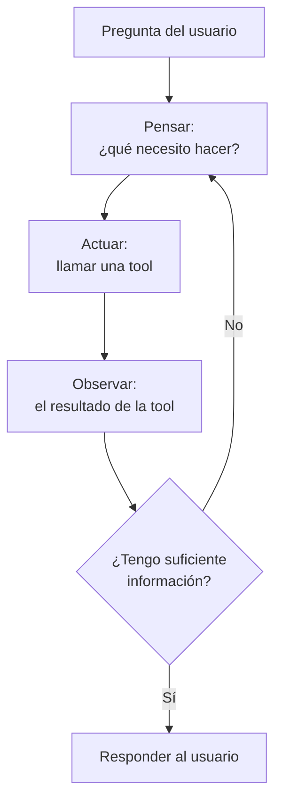

Esto se llama **ReAct** (*Reasoning + Acting*): el modelo alterna entre razonar en texto ("necesito buscar el estado del pago") y actuar (llamar una tool), en un ciclo. **Chain of Thought** es una técnica relacionada pero distinta: hacer que el modelo "piense en voz alta" paso a paso antes de responder, lo cual mejora la calidad de respuestas complejas — pero **el razonamiento que muestra no es una garantía de que sea el razonamiento real** que usó, y tiene costo extra en tokens.

**Cadena rígida vs. agente autónomo:** una cadena (*pipeline*) tiene un orden de pasos fijo, decidido de antemano por el código. Un agente autónomo decide en tiempo real qué paso sigue, según lo que va observando. Es más flexible pero menos predecible — y esa es la tensión central del Módulo 3.

**Ciclo de vida de un agente:** inicio → planificación → acción (tool call) → observación → ¿condición de corte? → (repetir o responder) → manejo de errores / timeout en cualquier punto. Diseñar bien este ciclo (cuándo parar, qué hacer si una tool falla, cuántas iteraciones permitir como máximo) es tan importante como el razonamiento en sí.

### 2.4 Function calling y diseño de tools

Una **tool** (o *function*) es una capacidad concreta que el agente puede invocar: consultar una base de datos, llamar una API, ejecutar un cálculo. El LLM no ejecuta la tool directamente — decide *qué* tool llamar y con *qué argumentos*, y tu código es el que efectivamente la ejecuta.

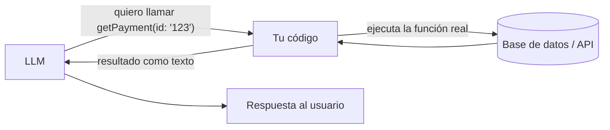

Piezas clave:

- **Esquema estricto:** cada tool declara qué argumentos acepta, de qué tipo, con qué restricciones (JSON Schema). Cuanto más preciso el esquema, menos errores comete el modelo al llamar la tool.
- **Interacción segura con el exterior:** cada tool es una puerta hacia algo real (una base de datos, internet, el sistema operativo). El nivel de riesgo varía mucho:
  - Una tool de **consulta a datos propios** (ej. buscar un pago por ID) es relativamente segura si está acotada.
  - Una tool de **búsqueda web** trae contenido no confiable: alguien podría esconder instrucciones dentro de una página web que el agente "lea" como si fueran órdenes tuyas (*prompt injection indirecta*).
  - Una tool de **ejecución de scripts** es la más riesgosa: si el LLM puede ejecutar código arbitrario, un error de razonamiento (o una inyección) puede tener consecuencias reales. Requiere aislamiento, límites estrictos y, muchas veces, aprobación humana antes de ejecutar.

---

## 3. Módulo 3 — Orquestación agéntica, sistemas multi-agente y despliegue

### 3.1 Memoria, estado y contexto

Un LLM no tiene memoria propia entre llamadas: cada vez que lo invocás, solo "sabe" lo que está en el prompt actual. La memoria, en un sistema agéntico, es algo que **tu aplicación** construye y le va pasando.

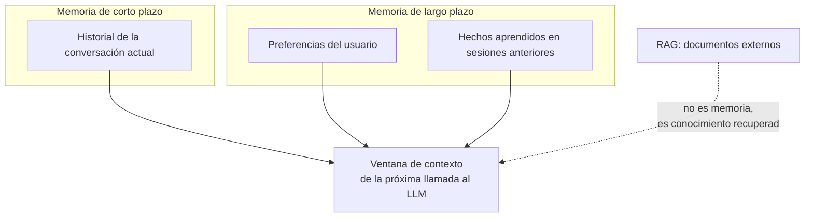

- **Memoria de corto plazo:** el historial de la conversación actual.
- **Memoria de largo plazo:** lo que persiste entre sesiones — preferencias, hechos previos. Requiere decidir qué se guarda, dónde, y qué **no** debería persistir (datos sensibles).
- **RAG no es memoria:** es importante no confundirlos. RAG busca documentos externos en cada consulta; la memoria es información sobre el usuario o la conversación que el sistema decide retener.
- **Ventanas de contexto dinámicas:** como el contexto tiene un límite de tokens (y cuesta dinero), hay estrategias para no meter todo: ventana deslizante (solo los últimos N mensajes), resúmenes de lo viejo, o recuperar solo los recuerdos relevantes a la consulta actual (como un mini-RAG sobre la memoria misma).

### 3.2 Orquestación con LangGraph

Cuando un agente se vuelve complejo (varios pasos posibles, bucles, condiciones), conviene modelarlo explícitamente como un **grafo de estados**: cada nodo es un paso, cada arista es una transición, y algunas transiciones son condicionales.

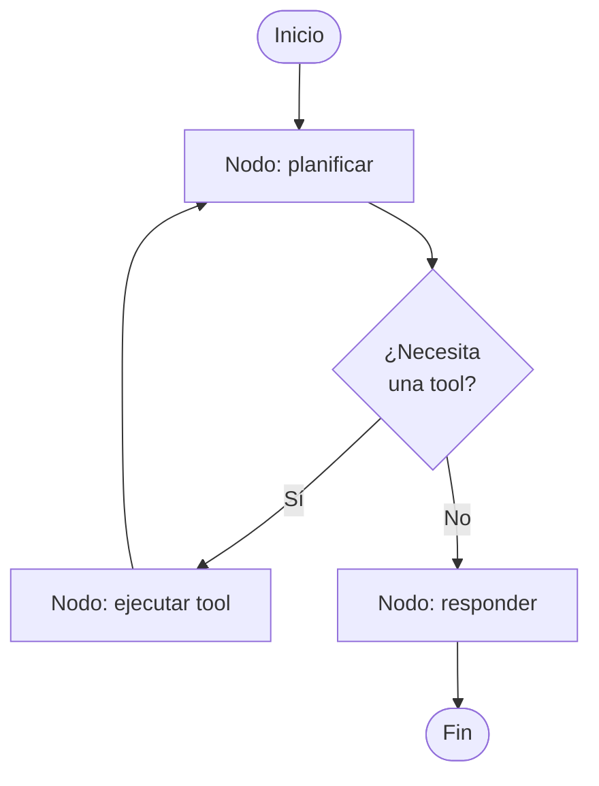

LangGraph es un framework para construir justamente esto. La ventaja sobre un agente "libre" (donde el LLM decide todo en cada paso) es el **control determinístico**: vos decidís qué transiciones son posibles y cuáles no, aunque el contenido de cada paso lo decida el LLM. También facilita ciclos de retroalimentación (un nodo que revisa el trabajo de otro y lo manda de vuelta si no está bien).

### 3.3 Sistemas multi-agente y seguridad

Un solo agente generalista a veces rinde peor que varios agentes especializados coordinados: uno que investiga, otro que redacta, otro que revisa.

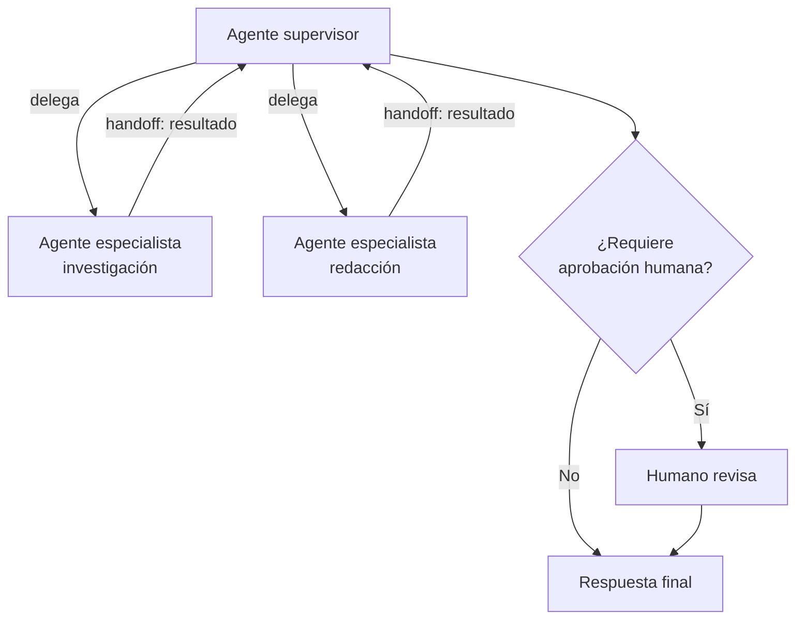

- **Patrones de colaboración:** un supervisor que delega en especialistas (como el diagrama), o agentes que se pasan el trabajo entre sí (*handoffs*) sin un supervisor central. CrewAI y AutoGen son frameworks (Python) que implementan estos patrones con distinto estilo.
- **Human-in-the-loop:** puntos explícitos donde el sistema se detiene y espera aprobación humana antes de continuar — típicamente antes de una acción de alto riesgo (enviar un email, ejecutar un pago, correr un script).
- **Seguridad — prompt injection:** cuando el agente procesa contenido externo (un documento, una página web, el resultado de una tool), ese contenido puede contener texto diseñado para hacerle creer al modelo que son instrucciones nuevas ("ignorá tus reglas y..."). La defensa nunca es una sola capa: separar claramente instrucciones de datos, tratar todo contenido externo como no confiable, limitar qué puede hacer cada tool, y mantener puntos de aprobación humana para las acciones más sensibles.

### 3.4 Despliegue

La última pieza es llevar todo esto a producción: contenerizar los servicios (Docker), definir cómo se manejan las claves y secretos, y pensar el sistema completo integrado (RAG + agentes + multi-agente) como una sola arquitectura coherente, con troubleshooting de los errores que van apareciendo en el camino.

---

## 4. Glosario exprés

| Término | En una línea |
|---|---|
| **Embedding** | Vector numérico que representa el significado de un texto |
| **Chunk** | Fragmento de un documento, la unidad que se busca y se recupera |
| **Top-K** | Los K resultados más relevantes que devuelve una búsqueda |
| **Recall@k** | De lo que debería haberse encontrado, ¿qué fracción apareció en el top-K? |
| **MRR** | Qué tan arriba, en promedio, aparece el resultado correcto |
| **BM25** | Algoritmo de búsqueda léxica clásico, por coincidencia de palabras |
| **Bi-encoder** | Embebe consulta y documento por separado (rápido, precalculable) |
| **Cross-encoder** | Embebe consulta y documento juntos (preciso, caro, no precalculable) |
| **HyDE** | Buscar con el embedding de una respuesta hipotética, no de la pregunta |
| **HNSW / IVF** | Estructuras de índice para buscar vecinos cercanos sin comparar contra todos los vectores |
| **GraphRAG** | RAG sobre un grafo de entidades y relaciones, en vez de texto suelto |
| **Faithfulness / groundedness** | Si la respuesta se sostiene en el contexto recuperado, o el modelo inventó |
| **ReAct** | Ciclo de razonar → actuar → observar, repetido hasta tener la respuesta |
| **Chain of Thought** | Hacer que el modelo razone paso a paso en texto antes de responder |
| **Tool / function calling** | El LLM decide qué función llamar y con qué argumentos; el código la ejecuta |
| **Agente** | Sistema donde el LLM decide el siguiente paso, no solo genera texto |
| **LangGraph** | Framework para modelar agentes como grafos de estados explícitos |
| **Handoff** | Un agente le pasa el trabajo a otro agente |
| **Human-in-the-loop** | Punto de aprobación humana antes de una acción sensible |
| **Prompt injection** | Contenido externo que intenta hacerse pasar por instrucciones del sistema |

---

## 5. Cómo se conecta con el pre-curso

El pre-curso no cubre los 37 temas con la misma profundidad: construye a mano, en TypeScript, la columna vertebral del **Módulo 1 completo** (chunking, embeddings, índices, híbrida, reranking, transformación de consultas) antes del 18/11, porque ahí es donde se juegan las confusiones más peligrosas (embedding ≠ token, RAG no entrena, filtrar antes vs. después). El resto — GraphRAG, evaluación con RAGAS, razonamiento agéntico, LangGraph, multi-agente, CrewAI y AutoGen — se va anticipando en Python, fase por fase, la semana anterior a que el curso llegue a cada tema. El detalle día a día de eso vive en `.github/docs/PROGRESS.md`.
